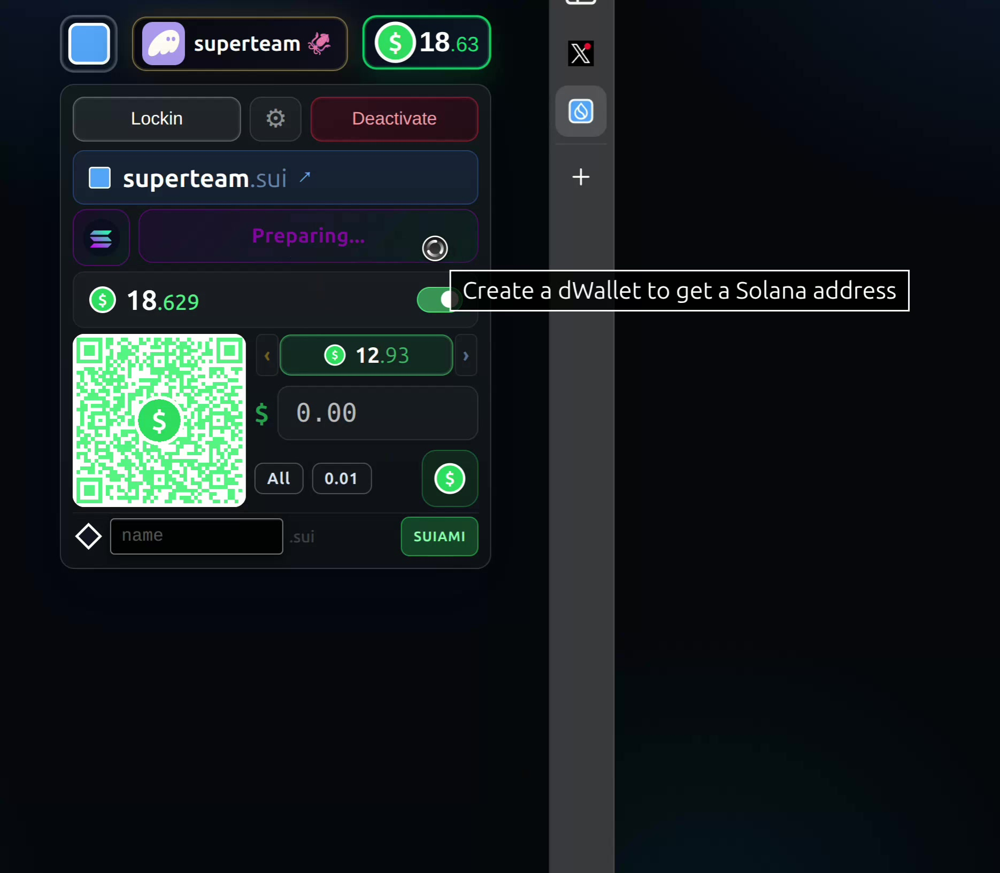

# .SKI — .Sui Key-In

.SKI once, everywhere.

[](https://www.npmjs.com/package/sui.ski)
[](https://sui.ski)

<a href="https://sui.ski"></a>

---

## Native Cross-Chain Wallets via IKA dWallets

Real Bitcoin, Ethereum, and Solana addresses controlled by your Sui account — no bridges, no wrapping, no custodians. Powered by [IKA](https://docs.ika.xyz)'s 2PC-MPC threshold signatures.

[](https://sui.ski/superteam)

> *[▶ Watch the demo](https://sui.ski/superteam) — streamed from [Walrus](https://walrus.xyz), Sui's decentralized storage protocol.*

### What One Sui Account Controls

| Curve | Chains | Address Format |
|-------|--------|----------------|
| **secp256k1** (1 DKG) | Bitcoin, Ethereum, Base, Polygon, Arbitrum, Optimism | `bc1q...`, `0x...` |
| **ed25519** (1 DKG) | Solana | base58 |

Two DKG ceremonies. Two dWallets. Seven chains. One Sui account.

### Why This Matters

- **No bridges** — BTC stays on Bitcoin, SOL stays on Solana. IKA generates real native addresses whose signing is governed by Sui smart contracts.
- **Non-collusive security** — 2PC-MPC means neither the user nor the network can sign alone. 100+ mainnet operators with Byzantine threshold.
- **Quantum-ready architecture** — Sui's flag-byte signature scheme (`flag || sig || pk`) lets the network add post-quantum primitives via a new flag byte — no hard fork, no address migration. IKA's per-curve DKG is inherently modular, so post-quantum dWallets slot in alongside existing ones. See [Mysten Labs' research on post-quantum readiness in EdDSA chains](https://eprint.iacr.org/2025/1368) and our full analysis in [`docs/ika-quantum-resistance.md`](docs/ika-quantum-resistance.md).

---

## Domain structure

| Domain | Purpose |
|---|---|
| `sui.ski` | Root — main application, embeddable widget, API endpoints |
| `<name>.sui.ski` | SuiNS profile pages (e.g. `brando.sui.ski` for `brando.sui`) |

All subdomains with 3+ characters are reserved for SuiNS profile pages. There are no dedicated subdomains for the app, API, or RPC — everything routes through the root domain.

A cross-domain session cookie (`ski:xdomain`) is set on `domain=sui.ski` so authentication persists across the root and all profile subdomains.

---

## UI overview

The `.SKI` header bar renders up to four elements in a row:

### Dot button (`ski-dot`)

Small status indicator on the far left. Shows the connected wallet's shape (diamond = address only, blue square = has SuiNS name, green circle = unconnected). Clicking it opens the **SKI modal** when disconnected, or toggles the **SKI menu** when connected. The dot carries a Splash drop overlay when a sponsor is active.

### Profile pill (`ski-profile`)

Displays the connected wallet icon, social badge (WaaP provider), SuiNS name, and live balance. Clicking the pill opens the wallet's `.sui.ski` profile page in a new tab when a SuiNS name is set. The balance cycles between SUI-primary and USD-primary on click.

### SKI button (`ski-btn`)

The main branded button showing the SKI logo and optionally the wallet shape, SuiNS name, and Splash drop. When disconnected, clicking it opens the **SKI modal**. When connected, it toggles the **SKI menu**. The modal and menu are mutually exclusive — opening one always closes the other.

### Balance pill

Shows the live USD-equivalent balance with a dollar icon. Click to cycle between SUI and USD display.

---

## SKI modal

A single-column overlay anchored below the SKI button, right-aligned with it. The modal has a fixed header (brand logo, balance, QR code) and a scrollable body containing:

- **Key detail pane** — the currently selected wallet with SuiNS name, address, balance, network badges, and Ika dWallet status. Defaults to the first blue-square wallet on open, falls back to the first black-diamond, then to WaaP.
- **Splash legend** — every key that has ever connected from this device, grouped by shape tier (diamond > blue square > green circle) with collapsible group arrows
- **+ new WaaP row** — always present in the green tier; clicking it shows a placeholder detail pane, and clicking that detail header disconnects any active WaaP session and opens a fresh WaaP OAuth modal
- **Wallet list** (alternative layout) — one row per installed wallet extension with shape badges and social icons

Each legend row shows the key shape, SuiNS name badge, truncated hex address (right-justified), and the wallet provider icon (Phantom, Backpack, WaaP social icon, Slush, Suiet, etc.).

**Long-press lock** — hold a row for 2.2 s to lock the detail pane to that wallet. An amber ring indicates locked state. Long-press again to unlock.

**Layout toggle** — the Splash/List switch at the bottom lets users choose between the splash legend view and the plain wallet list. Preference is persisted in `localStorage`.

## SKI menu

A dropdown menu beneath the SKI button (mutually exclusive with the modal). Contains:

- SuiNS name management — register new `.sui` names, set default, view owned names with renewal dates
- Marketplace purchase — buy listed names from Tradeport or on-chain kiosks directly from the name input
- Shade orders — privacy-preserving grace-period domain sniping with commitment-reveal
- Thunder — encrypt signals to any SuiNS identity
- Coin chips — swap between SUI, USDC, NS, and other tokens via DeepBook/Cetus
- SUIAMI — SUI-Authenticated Message Identity proofs
- Disconnect button
- Manage Keys — opens the modal from the menu

## Idle overlay

After 15 seconds of inactivity (or by cycling the SKI button), the menu collapses into a compact overlay with pixel art, a name search input, and a Thunder messaging row. The overlay closes the SKI menu behind it for a clean presentation.

The overlay name input mirrors the full menu's behavior:
- **Available names** → MINT button
- **Tradeport/kiosk listings** → TRADE button with price
- **Taken names** → Thunder button to send an encrypt signal
- **Owned names** → SUIAMI button to prove identity

## SuiNS integration

Full SuiNS lifecycle from the SKI menu:

- **Register** — search and register `.sui` names with instant tier pricing, pay with SUI, USDC, or NS tokens
- **Marketplace purchase** — names listed on Tradeport or in on-chain kiosks show a TRADE button with USD price; single-PTB purchase with optional token swap
- **Set default** — change your primary SuiNS name (updates the SKI button and profile instantly)
- **Target address** — view and copy the address a name points to, with color-coded status (purple = self, green = available, orange = kiosk-listed)
- **Owned names** — scrollable chip grid showing all names owned by the connected wallet, with grace-period expiry warnings and renewal cost estimates

## Thunder

Encrypt signals between SuiNS identities. On-chain encrypted messaging powered by [Seal](https://docs.mystenlabs.com/seal) threshold encryption (2-of-3 key servers) with ciphertext stored on [Walrus](https://walrus.xyz).

- **Signal** — encrypt and send a message to any `.sui` name; only the NFT owner can decrypt. Free signals (fee set to 0)
- **Quest** — claim and decrypt your signals, NFT-gated via Seal policies. Quest mode accessible from the idle overlay via the storm button. Fresh quest bubbles render with white background and support click-to-delete
- **Strike** — tap-to-delete removes the signal on-chain, routing the storage rebate to treasury. Server-side relay for WaaP wallets that can't run Seal in-browser
- **@tags** — mention other SuiNS names in signals with autocomplete from your roster
- **Conversation persistence** — signals are grouped by address, so conversations persist across SuiNS name changes

Thunder surfaces throughout the UI: as the default action when viewing someone else's taken name (no amount), in the idle overlay's messaging row, and via the quick-thunder button in the menu.

**Move contract (v4):** `0xb16f344c9f778be79d81ad3b3bd799476681d339a099ff9acaf2b7ea9e5d9581`

## Storm v1

Permissionless on-chain messaging primitive used by Thunder v5. No fees, no admin keys, no NFT gates.

- **Package:** `0xa3ed4fdf1369313647efcef77fd577aa4b77b50c62e5c5e29d4c383390cdf942`
- **Storm object:** `0x1b00663e83c9674ab49da1c6dd8c07e01aeff93d5c74c1785251f82cb61cb9e4`
- **Operations:** signal, quest, strike, sweep — all permissionless
- **ECDH-derived storm_id** — knowledge IS authorization. Hides who talks to whom; no on-chain link between sender and recipient

## SUIAMI

SUI-Authenticated Message Identity — cryptographic proof that a SuiNS name belongs to you. Sign a structured message with your wallet to generate a verifiable identity proof, validated server-side via `/api/suiami/verify`.

Used for sender authentication in Thunder signals and as a standalone identity primitive.

## SUIAMI Roster

Cross-chain identity resolver on Sui. Maps SuiNS names to addresses on any chain via a shared on-chain registry.

- **v1 Contract:** `0x4a04a5701ae8420c16e51597553fc3a21a19ebb5800d5f48cd98f75ecd429906`
- **v2 Package:** `0xef4fa3fa12a1413cf998ea8b03348281bb9edd09f21a0a245a42b103a2e9c3b4` — adds chain address reverse lookup
- **Roster object:** `0xf382a0e687f03968e80483dca5e82278278396b2d1028e0c1cee63968a62d689`
- **Dual-keyed lookup** — name hash, Sui address, and chain address strings
- **Reverse lookup** (v2) — resolve any chain address back to its SuiNS name
- **`VecMap<String,String>`** for chains — future-proof for post-quantum curves and arbitrary chain identifiers
- Piggybacked onto every user transaction

## iUSD — Yield-Bearing Stable

A dollar-pegged stablecoin backed by a diversified reserve of gold, silver, equities, energy, and dollar instruments — custodied natively across Bitcoin, Ethereum, Solana, and Sui via IKA dWallet threshold signatures. No bridges. No algorithms. Just reserves.

### Reserve Composition

| Tranche | Assets | Chains | Target |
|---------|--------|--------|--------|
| **Senior (60%)** — peg floor | USDC, BUIDL (BlackRock T-bills), staked SUI/SOL | Sui, Solana, Ethereum | ≥100% of supply |
| **Junior (40%)** — growth engine | XAUM (gold), XAGM (silver), TSLAx/NVDAx/SPYx (equities), BTC, crude oil | Sui, Ethereum, Solana, Bitcoin | Absorbs losses first |

150% minimum collateral ratio enforced on-chain. Senior tranche alone must cover 100% of iUSD supply.

### 9-Decimal Steganographic Encoding

iUSD uses 9 decimals (vs USDC's 6). The last 3 digits after cents encode transaction metadata — invisible to humans, identifiable on-chain:

```
$10.000003141  ← 3141 = truncated signal ID
     ^^^^^^    ^^^^
     visible   hidden identifier
```

Every iUSD mint is fingerprinted to the specific purchase that created it.

### Purchase Routing

Name registration routes through iUSD to grow treasury collateral:

1. User deposits SUI → keeper attests collateral → mints iUSD
2. Keeper swaps iUSD → USDC (DeepBook 1:1 pool) → NS (multi-DEX racing)
3. Keeper sends NS to user → user registers name with 25% NS discount
4. Surplus stays in treasury

Multi-DEX racing (Aftermath aggregator vs direct DeepBook) picks the best USDC → NS rate. Aftermath internally races across 15+ DEXes including Cetus, Bluefin, FlowX, Kriya, and Turbos.

**v1 Contract (deprecated, 6 decimal):** `0xf62ecf124076dac335549f28ad74620da2538a89f0ab27e4b9dc113638565515`

**v2 Package:** `0x2c5653668edefe2a782bf755e02bda56149e7b65b56f6245fb75b718941d2ec9`
**v2 Treasury:** `0x64435d5284ba3867c0065b9c97a8a86ee964601f0546df2caa5f772a68627beb`
**v2 TreasuryCap:** owned by ultron.sui — 9-decimal steganographic encoding

### Revenue Streams

| Source | Mechanism |
|--------|-----------|
| SuiNS registration 5% cut | PTB fee extraction on every mint |
| Shade order 10% escrow | Fee on execute() |
| Thunder volume | Free signals drive adoption → more names registered → more iUSD minted |
| Swap spread | 0.1% on DeepBook/Cetus/Bluefin routing |
| Treasury asset appreciation | Blended yield on diversified reserve |
| Lending yield | NAVI + Scallop + Kamino |

## Marketplace Purchase

Buy SuiNS names listed on Tradeport or in on-chain kiosks directly from the SKI menu or idle overlay:

- **Detection** — name input checks Tradeport API for active listings, caches in sessionStorage
- **TRADE button** — shows listing price in Tradeport orange, appears in both SKI menu and idle overlay
- **Atomic purchase** — single-PTB with optional token swap (any held token → SUI → purchase)
- **Enter key** — triggers the action button globally while overlay is open

---

## Session layer

After connecting, .SKI requests one personal message signature to prove key ownership. The signed proof is tied to a FingerprintJS `visitorId` (device fingerprint) and stored in `localStorage`. On reload the session is restored silently — no re-signing required until it expires (7 days for software wallets, 24 hours for hardware/Keystone).

Session format: `{ address, signature, bytes, visitorId, expiresAt }` — stored under `ski:session`.

## Splash sponsorship

Splash is a device-level gas sponsor system. A wallet owner activates Splash to cover gas fees for every key connected from the same device. Sponsored transactions use Sui's sponsored transaction flow.

- Activate via the Splash button in the modal header or the detail card
- Devices that connect through `?splash={address}` are enrolled automatically
- SuiNS names work as the sponsor parameter: `?splash=brando.sui`
- The drop badge appears on keys covered by an active sponsor

## Shade

Privacy-preserving SuiNS grace-period domain sniping via on-chain commitment-reveal. A Move contract stores only `keccak256(domain || execute_after_ms || target_address || salt)` — the domain name, target address, and execution timestamp remain hidden until reveal at execution time.

- **ShadeOrder** — a shared object holding the owner address, escrowed SUI balance, and opaque commitment hash
- **`execute()`** — permissionless; anyone with the preimage can call, enabling keeper bots
- **`cancel()`** — owner-only; returns escrowed SUI
- **ShadeExecutorAgent** — Cloudflare Durable Object that auto-executes orders at grace-period expiry via DO Alarms, using a dedicated keeper address with its own gas
- Three execution routes: SUI->NS (DeepBook), SUI->USDC->NS (two-hop), or SUI direct fallback

Contract: `0xfcd0b2b4f69758cd3ed0d35a55335417cac6304017c3c5d9a5aaff75c367aaff`

See [SHIELD.md](SHIELD.md) for the full security model and threat analysis.

## WaaP (social login)

WaaP provides custodial wallet creation via social login, email, phone, and biometrics — no browser extension required. A static placeholder wallet is always present in the SKI modal so the "+ new WaaP" row renders instantly on page load, before the WaaP SDK finishes initializing.

| Auth method | Status |
|---|---|
| Social (X, Google, Discord, GitHub) | Active |
| Email | Active |
| Phone | Active |
| Biometrics | Active |

WaaP accounts appear in the legend with their social provider icon (X, Google, Discord, or email envelope). Clicking an existing WaaP blue-square row reconnects via encrypted device proof (zero-modal). Clicking "+ new WaaP" forces a full disconnect and opens a fresh OAuth flow.

---

## Deployed Contracts

| Contract | Package | Key Objects |
|----------|---------|-------------|
| iUSD v2 | `0x2c5653668edefe2a782bf755e02bda56149e7b65b56f6245fb75b718941d2ec9` | Treasury: `0x64435d5284ba...627beb`, TreasuryCap: ultron.sui |
| SUIAMI Roster v2 | `0xef4fa3fa12a1413cf998ea8b03348281bb9edd09f21a0a245a42b103a2e9c3b4` | Roster: `0xf382a0e687f03968e80483dca5e82278278396b2d1028e0c1cee63968a62d689` |
| Storm v1 | `0xa3ed4fdf1369313647efcef77fd577aa4b77b50c62e5c5e29d4c383390cdf942` | Storm: `0x1b00663e83c9674ab49da1c6dd8c07e01aeff93d5c74c1785251f82cb61cb9e4` |
| Thunder v4 | `0xb16f344c9f778be79d81ad3b3bd799476681d339a099ff9acaf2b7ea9e5d9581` | — |
| Shade | `0xfcd0b2b4f69758cd3ed0d35a55335417cac6304017c3c5d9a5aaff75c367aaff` | — |

## ultron.sui

Autonomous agent wallet for all server-side operations.

- **Address:** `0xa84cebfde3f0522cd893263d5208a633cd226a1585249b32f02d77438094b3c3`
- **Roles:**
  - iUSD minter and oracle (collateral attestation, mint, DeepBook/Aftermath routing)
  - Storm admin
  - Shade executor (keeper bot, auto-executes at grace expiry)
  - Thunder relay (server-side signal relay for WaaP wallets)
  - Dust sweep (consolidates small coin objects)
  - Fee sweep (collects protocol revenue)

---

## Install

```bash
npm install sui.ski
# or
bun add sui.ski
```

## Embed via script tag (CDN)

```html
<link rel="stylesheet" href="https://cdn.jsdelivr.net/npm/sui.ski/public/styles.css">
<script type="module" src="https://cdn.jsdelivr.net/npm/sui.ski/public/dist/ski.js"></script>
```

Add the widget markup anywhere in your `<body>`:

```html
<div class="ski-header">
  <div class="ski-wallet" id="ski-wallet">
    <button class="ski-btn ski-dot" id="ski-dot" style="display:none"></button>
    <div id="ski-profile"></div>
    <button class="ski-btn" id="ski-btn" style="display:none"></button>
    <div id="ski-menu"></div>
  </div>
</div>
<div id="ski-modal"></div>
```

The script auto-initializes on load — no further JS required.

## Embed via bundler

```ts
import 'sui.ski';
```

Same DOM markup as above is required.

## Events

```ts
window.addEventListener('ski:wallet-connected', (e: CustomEvent) => {
  const { address, walletName } = e.detail;
});

window.addEventListener('ski:wallet-disconnected', () => {});

// Request sign-in (opens modal, then triggers sign + redirect to sui.ski)
window.dispatchEvent(new CustomEvent('ski:request-signin'));
```

## Requesting a transaction

```ts
import { Transaction } from '@mysten/sui/transactions';

const tx = new Transaction();
// ... build your transaction

window.dispatchEvent(new CustomEvent('ski:sign-and-execute-transaction', {
  detail: { transaction: tx, requestId: 'my-req-1' }
}));

window.addEventListener('ski:transaction-result', (e: CustomEvent) => {
  const { requestId, success, digest, error } = e.detail;
});
```

If a Splash sponsor is active, the sponsored flow is used automatically.

## Modal API

```ts
import { openModal } from 'sui.ski';
import { setModalLayout, type ModalLayout } from 'sui.ski';

// Layouts: 'splash' (default), 'list' (wallet list only), 'layout2' (no Splash strip)
setModalLayout('list');
```

## Supported wallets

Any wallet implementing the [Sui Wallet Standard](https://docs.sui.io/standards/wallet-standard):

| Wallet | Shape | Notes |
|---|---|---|
| Phantom | Diamond/Blue | |
| Backpack | Diamond/Blue | Keystone hardware via Backpack supported (24 h session) |
| Slush | Green | |
| Suiet | Green | |
| Keystone | Diamond | Direct extension; auto-prompts on connect |
| WaaP | Diamond/Blue/Green | Social/email/phone/biometrics wallet; provider badge displayed |
| Any Sui Wallet Standard extension | Varies | |

Shape is determined by state: green circle = never connected, black diamond = connected (no SuiNS), blue square = connected with SuiNS name.

## Self-hosting / Cloudflare Worker deploy

```bash
bun install
npx wrangler login
bun run build && npx wrangler deploy
```

The worker hosts five Durable Objects:

| Binding | Purpose |
|---|---|
| `SessionAgent` | Verifies signed sessions server-side |
| `SponsorAgent` | Manages Splash sponsor state |
| `SplashDeviceAgent` | Tracks per-device Splash activation (keyed by FingerprintJS `visitorId`) |
| `ShadeExecutorAgent` | Auto-executes Shade orders at grace-period expiry via DO Alarms |
| `TreasuryAgents` | Signed by ultron.sui — autonomous agent for iUSD minting, collateral attestation, NS acquisition, dust sweeps, Thunder relay |

API routes served by the worker:

| Route | Purpose |
|---|---|
| `/agents/*` | WebSocket upgrade for Durable Object agents |
| `/api/health` | Health check |
| `/api/shade/*` | Shade order management (poke, status, schedule) |
| `/api/suiami/verify` | SUIAMI identity proof verification |
| `/api/thunder/strike-relay` | Server-side Thunder signal relay for WaaP wallets |
| `/api/tradeport/listing/:label` | TradePort listing proxy |

## IKA dWallet Integration

Native cross-chain addresses via IKA's 2PC-MPC threshold signatures. Two dWallets (secp256k1 + ed25519) control real Bitcoin, Ethereum, and Solana addresses — no bridges, no wrapping, no custodians.

### Architecture

| Layer | File | Purpose |
|-------|------|---------|
| Chain registry | `src/client/chains.ts` | CAIP-2 chain → IKA curve/algo/derivation mapping |
| Address derivation | `src/client/ika.ts` | Extract pubkey from dWallet → derive chain addresses |
| Multi-curve DKG | `src/client/ika.ts` | `Curve.SECP256K1` (BTC/EVM) + `Curve.ED25519` (Solana) |
| Signing ceremony | `src/client/ika-signing.ts` | 5-phase 2PC-MPC signing with browser presign pool |
| gRPC adapter | `src/server/grpc-7k-adapter.ts` | Wraps SuiGrpcClient for 7K SDK compatibility |
| DKG provisioning | `src/server/ika-provision.ts` | Server-side sponsored dWallet creation |
| SuiNS gate | `src/server/index.ts` | Gas sponsorship gated by SuiNS NFT ownership |
| Quantum analysis | `docs/ika-quantum-resistance.md` | Signature schemes, Shor's algorithm impact, migration paths |

### How it works

1. **Sign in** → check for existing dWallets via `getCrossChainStatus()` (scans all caps, detects curve)
2. **No dWallet + has SuiNS** → sponsored DKG tx (SUI→IKA swap via Cetus CLMM in same PTB), user co-signs
3. **Network selector** → choose Sui, Bitcoin, or Solana view
4. **Create** → runs DKG for the correct curve (secp256k1 for BTC, ed25519 for Solana), skips if already exists
5. **dWallet active** → derive native address from public output (P2WPKH, EVM keccak, or base58)

### Post-Quantum Readiness

Both secp256k1 and ed25519 are vulnerable to Shor's algorithm. The architecture is designed for the transition:

- **Sui's flag-byte scheme** — adding post-quantum signatures = new flag byte + verifier, no hard fork
- **IKA's per-curve DKG** — post-quantum dWallets coexist with existing ones, users migrate at their own pace
- **Defense in depth** — even before target chains go post-quantum, Sui's authorization layer can adopt quantum-safe auth independently
- **Mysten Labs research** — [ePrint 2025/1368](https://eprint.iacr.org/2025/1368) describes backward-compatible quantum-safe migration for EdDSA chains (Sui, Solana, Near, Stellar, Cosmos)

Full analysis: [`docs/ika-quantum-resistance.md`](docs/ika-quantum-resistance.md)

### Credits

Chain registry and signing ceremony adapted from [inkwell-finance/ows-ika](https://github.com/inkwell-finance/ows-ika) (MIT) — Inkwell Finance's OpenWallet Standard adapter for IKA dWallets.

---

## Stack

- `@mysten/sui` ^2.5.1, `@mysten/suins` ^1.0.2, `@human.tech/waap-sdk` ^1.2.2, `@ika.xyz/sdk` ^0.3.1
- DEX: `aftermath-ts-sdk` (aggregation), DeepBook v3 (direct pools), Bluefin CLMM, Cetus CLMM
- Transport: `SuiGrpcClient` primary with `SuiGraphQLClient` fallback (no JSON-RPC)
- gRPC proxy: Hayabusa at `hb.sui.ski` — racing proxy across Mysten, PublicNode, BlockVision, Ankr with two-tier caching (L1 Cache API + L2 KV)
- Crypto: `@noble/hashes` (SHA-256, RIPEMD-160), `@scure/base` (bech32)
- Build: `bun build src/ski.ts --outdir public/dist --target browser`
- Deploy: Cloudflare Workers + Wrangler 4.78

## Local development

```bash
bun install
bun run dev          # watches src/ski.ts, rebuilds on change
# in a second terminal:
bun run dev:wrangler # wrangler dev with hot reload
```

Open `http://localhost:8787` — always use `http://localhost` (not `file://`) so wallet extensions have a valid origin.

## License

MIT
